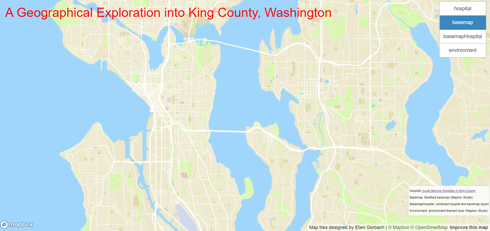
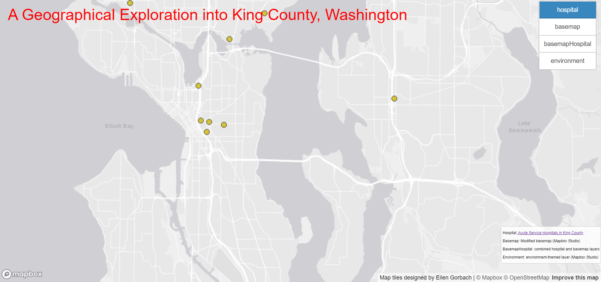
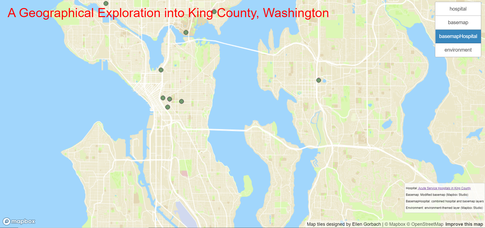

# Practicing with QTiles
## Author: Ellen Gorbach

## Map
[Web Map - Seattle Tile Sets](https://gorbachellen.github.io/qtiles/index.html)

## Descriptions
These layers all examine the geography of King County with an initial focus on the Seattle/Eastside area. Each layer has zoom levels 1-13. The first tile set (based on the image order above, not the one in the web app) is a modified basemap. The modified basemap is a custom-designed, muted version of the Basic map style in Mapbox, complete with new fonts, colors, and icons. The second tile set is the acute service hospitals in King County layer. It shows a point shapefile of hospital locations on a classic ESRI gray (light) basemap. The third tile set is a combination of the first two, provided a better image of the hospital locations. The final tile set is a themed layer, also a custom-designed version of the Basic map style in Mapbox, however, it's completely created to mimic the natural green tones that nature in Pacific Northwest takes on. It's an environmental themed layer. 

## Data Sources
I used Mapbox Studio to efficiently design the custom basemap and environmental themed layers.

The data used to make the hospital layer was gathered from:
- [King County GIS Open Data](https://gis-kingcounty.opendata.arcgis.com/datasets/kingcounty::acute-service-hospitals-in-king-county-hospitals-point/explore?location=47.542492%2C-121.988865%2C10.00)